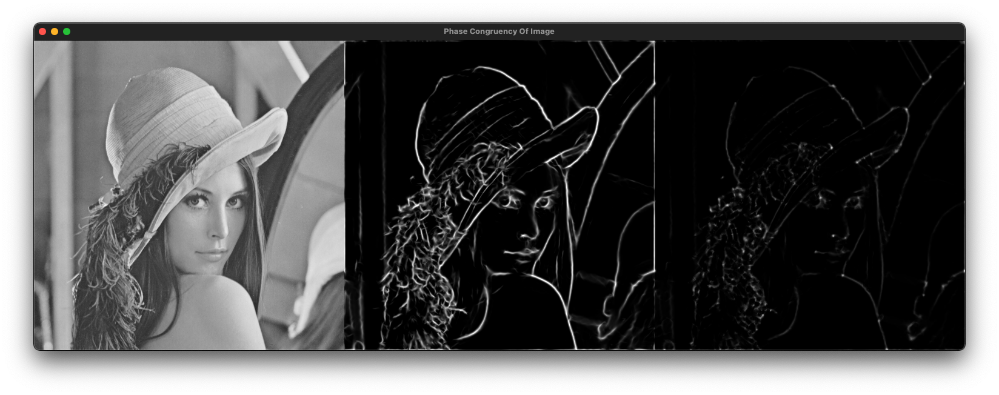

# ofxPhaseCongruencyEdge

OpenFrameworks addon for Phase Congruency based Edge and Corner detection. Phase Congruency technique provides more robust edge and corner detection compared to traditional methods, especially in images with varying lighting conditions and shadows.



## Features

- Robust edge detection using Phase Congruency technique
- Robust corner detection using Phase Congruency technique
- More resilient to lighting changes and shadows than traditional methods (Sobel, Canny, Harris, etc.)
- Simple to use API with setup and process methods
- Supports both edge and corner detection from the same analysis

## Requirements

- OpenFrameworks 0.11.x or later
- ofxCv addon
- ofxOpenCv addon

## Installation

1. Clone this repository into your OpenFrameworks/addons folder:
```
cd openFrameworks/addons
git clone https://github.com/bemoregt/ofxPhaseCongruencyEdge.git
```

2. Add the addon to your project using the OF Project Generator.

## Usage

### Basic Example

```cpp
#include "ofApp.h"
#include "ofxPhaseCongruencyEdge.h"

class ofApp : public ofBaseApp {
public:
    ofxPhaseCongruencyEdge pc;
    ofImage inputImage;
    ofImage edgeImage;
    ofImage cornerImage;
    
    void setup() {
        // Load an image
        inputImage.load("example.jpg");
        
        // Initialize the phase congruency detector
        // Parameters: width, height, scales, orientations
        pc.setup(inputImage.getWidth(), inputImage.getHeight(), 4, 6);
        
        // Process the image
        pc.process(inputImage, edgeImage, cornerImage);
    }
    
    void draw() {
        // Draw original image
        inputImage.draw(0, 0, 512, 512);
        
        // Draw edges
        edgeImage.draw(512, 0, 512, 512);
        
        // Draw corners
        cornerImage.draw(1024, 0, 512, 512);
    }
};
```

### Advanced Usage

You can customize the Phase Congruency algorithm parameters:

```cpp
PhaseCongruencyConst params;
params.minwavelength = 2.0;  // Minimum wavelength for filters
params.mult = 2.5;           // Wavelength multiplier between scales
params.sigma = -1.0 / (2.0 * log(0.75) * log(0.75));  // Bandwidth of filters
params.cutOff = 0.5;         // Cut-off value for weighting
params.g = 12.0;             // Gain factor for weighting
params.k = 8.0;              // Noise sensitivity factor
params.epsilon = 0.0001;     // Used to prevent division by zero

pc.setParameters(params);
```

## How it Works

Phase Congruency measures the consistency of phase information at different scales. Unlike gradient-based methods that look for intensity changes, Phase Congruency identifies features where phase components of the Fourier transform align. This makes it less susceptible to variations in illumination or contrast.

The main steps of the algorithm are:
1. Create log-Gabor filters at different scales and orientations
2. Transform the image using FFT
3. Filter the frequency domain representation
4. Compute phase congruency across scales
5. Calculate covariance data from oriented information
6. Extract edges from maximum moment and corners from minimum moment

## Credits

This addon is based on the Phase Congruency concept by Peter Kovesi. The implementation is adapted from the original C++ code by @bemoregt.

## License

MIT License